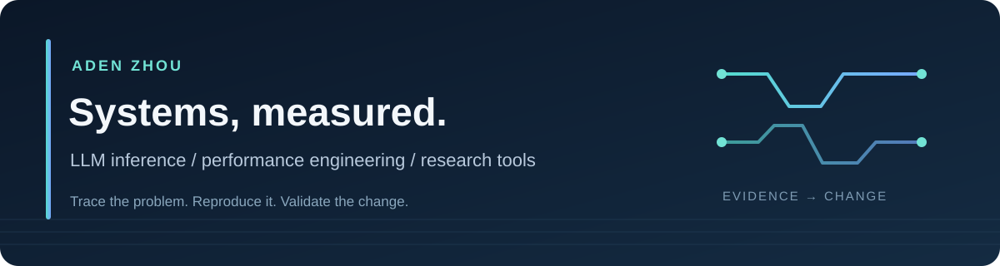

  

 

I work on **LLM inference, performance, and research tooling**. My contributions start with a reproducible problem and end with a small change whose evidence and limits are easy to inspect.

我关注大模型推理与性能工程：先确认真实问题，再提交可复现、可审查的改动。

### Merged upstream contributions

These links go to **my merged pull requests**, with the code, review, and validation record. The projects are maintained by their respective communities.

- **[Mooncake · PR #4063](https://github.com/kvcache-ai/Mooncake/pull/4063)** — Added an opt-in byte budget for queued TCP transfers, so an item-count limit does not hide retained payload memory. **Merged**.
- **[vLLM · PR #56882](https://github.com/vllm-project/vllm/pull/56882)** — Preserved image block spacing in DeepSeek V4 multimodal prompts. **Merged**.
- **[LMDeploy · PR #5000](https://github.com/InternLM/lmdeploy/pull/5000)** — Restored `os.getenv` even when environment parsing raises an error. **Merged**.

[Read the short case studies and validation limits →](CONTRIBUTIONS.md)

### Projects I build

- **[minimind-diffusion](https://github.com/adenzhou1350/minimind-diffusion)** — Small text and multimodal diffusion language models, from training to inference.
- **[soul-generator](https://github.com/adenzhou1350/soul-generator)** — A reusable tool for creating OpenClaw persona configurations.

### Current work

`Trace a real workload` → `reproduce the issue` → `validate the change` → `submit for review`

I am also building an evidence-based research workflow. Its leads and open PRs are **work in progress**, not merged upstream contributions. [See my open PRs](https://github.com/pulls?q=is%3Apr+is%3Aopen+author%3Aadenzhou1350).

Contact: aden1350@outlook.com
